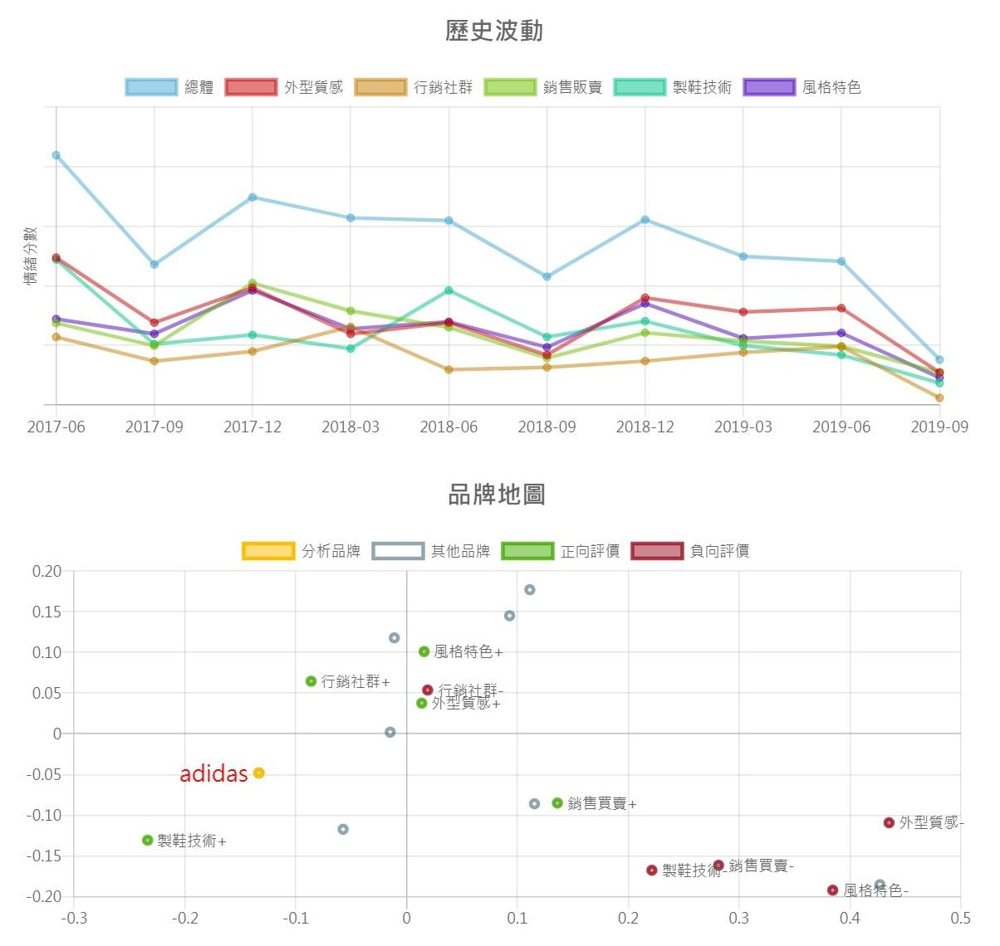

# Projects 

---

## GearLyze ## 

#### Description ####
The purpose of GearLyze was to provide a brand search system. After users enter the brand to be searched, the system will perform an analysis of the articles on the forum and position it by correspondence analysis.

---

[CIFAR-10 classification](https://github.com/SuiseiSaika/CIFAR-10_in_Keras)

#### Description

---

[DL-VoiceChanger](https://github.com/SuiseiSaika/DL-VoiceChanger)

#### Description

---

### Practice
[MNIST classification](https://github.com/SuiseiSaika/TF2G_MNIST)

[Fashion_MNIST classification](https://github.com/SuiseiSaika/TF2G_Fashion_MNIST)

[IMDb classification](https://github.com/SuiseiSaika/TF2G_IMDb/blob/master/TF2G_IMDb_RNN.ipynb)

[Generative adversarial network]

---

# Skillset

- Programming Languages: Java, Python, JavaScript
- Deep learning frameworks: TensorFlow, Keras, Pytorch

---

# Certifications
- [Machine Learning](https://coursera.org/share/97485b47daa8b0543f5d5f850cc35206)
- [Deep Learning](https://coursera.org/share/99fee14fb34a858f2df4a546f81a44c3)
- [DeepLearning.AI TensorFlow Developer](https://coursera.org/share/d08708fcd424a0a266835c60f3bde941)
- [COVID-19 Contact Tracing](https://coursera.org/share/e183c018c08495faf70b3077a5749d4b)

---
